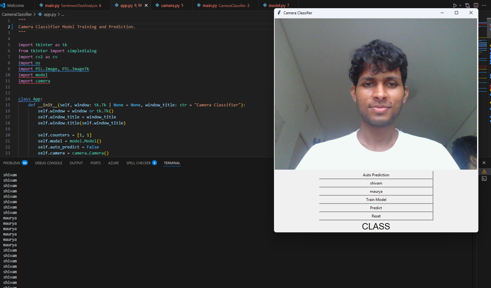

# CameraClassifier

A simple, fully-functioning webcam classifier that lets you capture examples for two classes, train a Support Vector Machine (SVM), and perform live predictions via a Tkinter GUI. Inspired by NeuralNine's original concept (see attribution below).

## Features
- Live webcam preview (OpenCV + Tkinter)
- One-click sample capture for two classes
- Train a linear SVM on your captured samples
- Manual and auto prediction modes
- Simple reset to clear captured samples

## Requirements
- Python 3.9+ recommended
- A functional webcam
- OS support: macOS, Linux, Windows
- Packages listed in repo root `requirements.txt`
  - numpy, opencv-python, Pillow, scikit-learn, matplotlib, tensorflow (TensorFlow is used by other subprojects; not required for CameraClassifier, but present in shared requirements)

Install dependencies (from repo root):

```
python -m venv venv
# On macOS/Linux
source venv/bin/activate
# On Windows
# venv\Scripts\activate.bat

pip install -r requirements.txt
```

## How to Run
From the repository root:

```
python -m CameraClassifier.main
```

Alternatively, within the `CameraClassifier` directory:

```
python main.py
```

When the app starts, you will be prompted to enter two class names (e.g., "Open Hand" and "Closed Fist"). If you cancel, defaults "Class 1" and "Class 2" are used.

## Usage
1. Collect Samples
   - Pose/scene for your first class and click the button labeled with your first class name to capture samples. Repeat several times (20–50 is a good start).
   - Do the same for the second class.
   - Captured images are stored in `CameraClassifier/1/` and `CameraClassifier/2/` as small grayscale thumbnails.
2. Train
   - Click "Train Model". The app will train a linear SVM using your captured samples.
3. Predict
   - Click "Predict" to classify the current frame, or toggle "Auto Prediction" for continuous predictions. The predicted class is shown under "CLASS".
4. Reset
   - Click "Reset" to clear all captured images and reset the model.

## Verification (Quick Test Without GUI)
If you cannot use a webcam (e.g., headless environment), you can still verify the training/prediction logic:

```
python - << 'PY'
import os, cv2 as cv, numpy as np
from CameraClassifier import model

# Create synthetic data folders relative to this script execution path
os.makedirs('1', exist_ok=True)
os.makedirs('2', exist_ok=True)

# Generate simple synthetic images for class 1 (bright) and class 2 (dark)
for i in range(10):
    img1 = np.full((150,150), 220, dtype=np.uint8); cv.imwrite(f'1/frame{i+1}.jpg', img1)
    img2 = np.full((150,150), 30, dtype=np.uint8);  cv.imwrite(f'2/frame{i+1}.jpg', img2)

m = model.Model()
m.train_model([11,11])

# Predict on synthetic RGB frames
bright_rgb = cv.cvtColor(np.full((150,150),220, dtype=np.uint8), cv.COLOR_GRAY2RGB)
dark_rgb   = cv.cvtColor(np.full((150,150), 30, dtype=np.uint8), cv.COLOR_GRAY2RGB)

p1 = m.predict(bright_rgb)
p2 = m.predict(dark_rgb)
print('Pred bright ->', p1)
print('Pred dark   ->', p2)

# Cleanup synthetic data
import shutil
shutil.rmtree('1', ignore_errors=True)
shutil.rmtree('2', ignore_errors=True)
PY
```
Expected output should show two different class labels (1 for bright images and 2 for dark images, though class mapping depends on your synthetic data creation).

## Troubleshooting
- Webcam not opening / black screen:
  - Another application may be using the camera. Close it and try again.
  - On macOS, grant Terminal/Python camera permissions in System Settings > Privacy & Security > Camera.
  - On Linux/Wayland, ensure `/dev/video*` is accessible and try `index=0/1` in `CameraClassifier/camera.py`.
- Tkinter import errors:
  - Linux (Debian/Ubuntu): `sudo apt-get install python3-tk`
  - macOS (Apple Silicon) with Homebrew Python 3.13:
    - Try: `brew install python-tk@3.13` (or `brew install python-tk` for other versions)
    - Ensure your venv uses the same Python you installed Tk for (recreate venv if needed)
  - macOS alternative: Install the official Python from python.org (includes Tcl/Tk), recreate venv, reinstall requirements
  - Conda: `conda install tk`
- Training says "Not enough data to train":
  - Capture samples for both classes (at least a few images per class).
- Pillow deprecation warning for ANTIALIAS:
  - The code uses `PIL.Image.ANTIALIAS` for compatibility. Recent Pillow aliases it to `Resampling.LANCZOS`.

## Project Layout
- `CameraClassifier/app.py` – Tkinter UI and app logic
- `CameraClassifier/camera.py` – Webcam capture (OpenCV)
- `CameraClassifier/model.py` – Linear SVM model (scikit-learn)
- `CameraClassifier/main.py` – Entry point

## Attribution
The idea and initial structure were inspired by NeuralNine's "Camera Classifier v0.1 Alpha" concept. This project adapts and extends it for practical use with minor safety and compatibility improvements.


## Python 3.13 Notes
- If you are using Python 3.13 on macOS arm64 (Apple Silicon), ensure you install dependencies from `CameraClassifier/requirements.txt` which now targets wheels compatible with Python 3.13:
  - NumPy 2.x
  - SciPy 1.14+
  - scikit-learn 1.5.x
- Command:
  - `pip install -r CameraClassifier/requirements.txt`
- If you still encounter binary compatibility issues, try upgrading pip first: `python -m pip install --upgrade pip`.


## Functionality
The app captures webcam frames, lets you save labeled samples for two classes, and trains a linear SVM on grayscale thumbnails of those samples. At prediction time, it takes the current frame, converts it to grayscale, resizes to 50×50, flattens, and predicts a class label (1 or 2). The GUI displays live video, buttons for collecting data, training, manual prediction, and an auto‑prediction toggle that classifies continuously.

- Data collection: saves 150×150 grayscale thumbnails into folders `1/` and `2/`.
- Training: fits a scikit‑learn SVC (linear kernel) on flattened 50×50 images.
- Prediction: processes the current frame the same way and queries the trained SVM.

## Testing
You can verify functionality in two complementary ways: headless tests (no GUI) and manual GUI checks.

### 1) Headless tests (no webcam/GUI required)
Run the built‑in tests that generate synthetic data and validate training/predict logic:

- From repo root:
  - `python -m CameraClassifier.test_camera_classifier`
- Or from the CameraClassifier folder:
  - `python -m CameraClassifier.test_camera_classifier`

Expected: the script prints `All tests passed.`

Notes:
- If Tkinter is not available in your environment, the GUI import test is skipped automatically.
- Optional: if you use pytest, you can run it as a module too: `python -m pytest -q CameraClassifier/test_camera_classifier.py`.

### Screenshot

### 2) Manual GUI test (with webcam)
- Start: `python -m CameraClassifier.main`
- Enter two class names when prompted (e.g., Open Hand / Closed Fist).
- Collect: capture 20–50 samples per class using the respective buttons.
- Train: click "Train Model"; watch console for potential warnings.
- Predict: click "Predict" or enable "Auto Prediction"; the predicted class shows under "CLASS".
- Reset: click "Reset" to clear samples and model state.

Troubleshooting for Tkinter and camera is listed above in the README.
